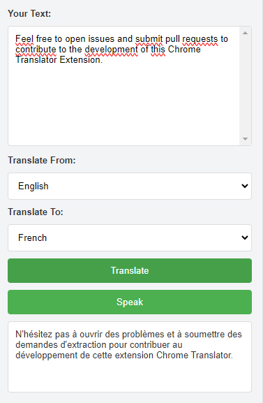

# Chrome Translator Extension

## Description

A simple Chrome extension for translating text using the MyMemory translation API. The extension allows users to input text, select the source and target languages, and then either translate or speak the translated text.

## Screenshot



## Features

- Translate text from one language to another.
- Listen to the translated text using the speech synthesis API.
- Supports a variety of languages.

## Installation

1. Clone the repository:

   ```bash
   git clone https://github.com/MohcineSafi/chrome-translator-extension.git

2. Open Chrome and go to chrome://extensions/.

3. Enable "Developer mode" in the top right corner.

4. Click on "Load unpacked" and select the folder where you cloned the repository.

## Usage

1. Open the extension by clicking on its icon in the Chrome toolbar.

2. Enter the text you want to translate in the provided textarea.

3. Select the source and target languages from the dropdown menus.

4. Click the "Translate" button to get the translation.

5. Optionally, click the "Speak" button to listen to the translated text.

## Contributing

Feel free to open issues and submit pull requests to contribute to the development of this Chrome Translator Extension.

## License

This project is licensed under the MIT License.
